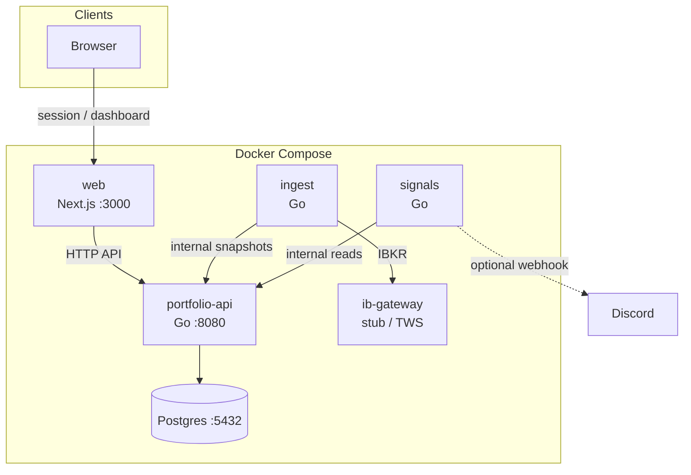

# morgans-d-stonks

US equities portfolio tracker — Go services + Next.js dashboard, connected to Interactive Brokers, running on a homelab via Docker Compose.

## Stack

- **Backend**: Go services (`portfolio-api`, `ingest`, `signals`)
- **Frontend**: Next.js 14 + Tailwind + shadcn/ui
- **Broker**: Interactive Brokers (paper mode by default)
- **DB**: Postgres 16
- **Infra**: Docker Compose

## Architecture

Services run on a shared Docker network (`portfolio-net`). The dashboard talks to the portfolio API; ingest and signals use the internal API key to call the API. Ingest pulls market and account data from IB Gateway (or a mock when `IBKR_MODE=mock`).



## Local development

1. `cp .env.example .env` and set at least `DATABASE_URL`, `INTERNAL_API_KEY`, and optional `DISCORD_WEBHOOK_URL`.
2. `docker compose up` — starts web, API, ingest, signals, Postgres, and an IB Gateway stub container.
3. Web UI: http://localhost:3000 (sign in with `AUTH_USERNAME` / `AUTH_PASSWORD` from `.env`).
4. API health: http://localhost:8080/api/health

### IB Gateway

- Select provider with `BROKER_PROVIDER` (`ibkr` default, `coinbase` reserved for follow-up work).
- For IBKR development without a live gateway, set `IBKR_MODE=mock` (used by `ingest`).
- With IB Gateway on the host (not in Docker), set `IBKR_GATEWAY_HOST=host.docker.internal` and configure Client Portal / TWS ports per [internal/broker/ibkr/DECISION.md](internal/broker/ibkr/DECISION.md).

### Stylekit (dashboard)

The UI lives in `apps/web` and uses **Tailwind CSS** plus **shadcn/ui**. To add more primitives:

```bash
cd apps/web
npx shadcn@latest add dialog
```

Theme tokens and radii are driven by CSS variables in `apps/web/app/globals.css` and `apps/web/tailwind.config.ts`.

## Project structure

```
apps/web/        Next.js dashboard
cmd/             Go service entry points
internal/        Go business logic (not public)
config/          Runtime config files (e.g. signals.yaml)
.agent/epics/    Agent instruction files per epic
```

See [AGENTS.md](AGENTS.md) for the full architecture, shared contracts, and agent workflow.

## Linear

[Portfolio platform project](https://linear.app/schtvr/project/portfolio-platform-1e44112535d4) — team `SCH`.
