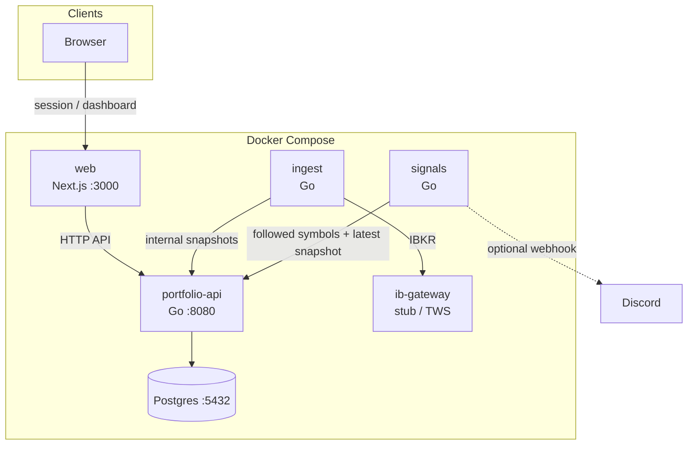

# morgans-d-stonks

US equities portfolio tracker with a crypto-only Coinbase alert/trading MVP, built with Go services + Next.js dashboard and deployed via Docker Compose.

## Stack

- **Backend**: Go services in `backend/` (`portfolio-api`, `ingest`, `signals`, `trading-worker`)
- **Frontend**: Next.js 14 + Tailwind + shadcn/ui in `frontend/`
- **Broker**: Interactive Brokers (paper mode by default)
- **Trading**: Coinbase order scaffolding, crypto alerting, paper execution simulation, and rollout controls
- **DB**: Postgres 16
- **Infra**: Docker Compose

## Architecture

Services run on a shared Docker network (`portfolio-net`). The dashboard talks to the portfolio API; ingest and signals use the internal API key to call the API. Ingest pulls market and account data from IB Gateway (or a mock when `IBKR_MODE=mock`). The signals service watches followed Coinbase crypto symbols and emits thresholded alerts.


```mermaid
flowchart TB
  subgraph Clients
    B[Browser]
  end

  subgraph Compose["Docker Compose"]
    W[web<br/>Next.js :3000]
    API[portfolio-api<br/>Go :8080]
    DB[(Postgres :5432)]
    ING[ingest<br/>Go]
    SIG[signals<br/>Go]
    IB[ib-gateway<br/>stub / TWS]
  end

  DC[Discord]

  B -->|session / dashboard| W
  W -->|HTTP API| API
  API --> DB
  ING -->|IBKR| IB
  ING -->|internal snapshots| API
  SIG -->|followed symbols + latest snapshot| API
  SIG -.->|optional webhook| DC
```

## Local development

1. `cp .env.example .env` and set at least `DATABASE_URL`, `INTERNAL_API_KEY`, and optional `DISCORD_WEBHOOK_URL`.
2. `docker compose up` - starts web, API, ingest, signals, Postgres, and an IB Gateway stub container.
3. `docker compose -f docker-compose.yml -f docker-compose.coinbase.yml up -d --build` - starts the same stack with Coinbase paper execution enabled for `portfolio-api` and `trading-worker`.
4. Web UI: http://localhost:3000 (sign in with `AUTH_USERNAME` / `AUTH_PASSWORD` from `.env`).
5. API health: http://localhost:8080/api/health

### IB Gateway

- `ingest` stays on `INGEST_BROKER_PROVIDER=ibkr` with `INGEST_IBKR_MODE=mock` for local Docker.
- `portfolio-api` and `trading-worker` use Coinbase paper defaults in Compose via `PORTFOLIO_BROKER_PROVIDER=coinbase` and `TRADING_BROKER_PROVIDER=coinbase`.
- For direct binary runs, `BROKER_PROVIDER` and `BROKER_ENV` still control the broker selection.
- With IB Gateway on the host (not in Docker), set `IBKR_GATEWAY_HOST=host.docker.internal` and configure Client Portal / TWS ports per [internal/broker/ibkr/DECISION.md](internal/broker/ibkr/DECISION.md).

### Coinbase trading rollout

- Use `docker-compose.coinbase.yml` when you want the paper Coinbase worker and portfolio API to boot together with the dashboard.
- Keep `TRADING_ENABLED=false` in the base stack until the allowlists and max-notional controls are configured.
- The Coinbase paper execution adapter is enabled in the override with `BROKER_PROVIDER=coinbase` and `BROKER_ENV=paper`.
- The trading worker and API expose Prometheus-compatible metrics on `GET /metrics`.
- Operational guidance lives in [docs/runbooks/coinbase-trading.md](docs/runbooks/coinbase-trading.md).

### Crypto alerts

- The signals service uses `SIGNAL_MOVE_THRESHOLD_PCT` and `SIGNAL_COOLDOWN` to control alert volume.
- Followed symbols are persisted in Postgres and seeded from the first crypto snapshot.
- Alerts are emitted as compact JSON payloads for Discord/OpenClaw consumption.
- The dashboard exposes a watchlist, alert-controls panel, and recent-alerts panel for the crypto MVP.

### Stylekit (dashboard)

The UI lives in `frontend/` and uses **Tailwind CSS** plus **shadcn/ui**. To add more primitives:

```bash
cd frontend
npx shadcn@latest add dialog
```

Theme tokens and radii are driven by CSS variables in `frontend/app/globals.css` and `frontend/tailwind.config.ts`.

## Project structure

```
backend/         Go backend module
frontend/        Next.js dashboard
.agent/epics/    Agent instruction files per epic
```

See [AGENTS.md](AGENTS.md) for the full architecture, shared contracts, and agent workflow.

## Linear

[Portfolio platform project](https://linear.app/schtvr/project/portfolio-platform-1e44112535d4) - team `SCH`.
