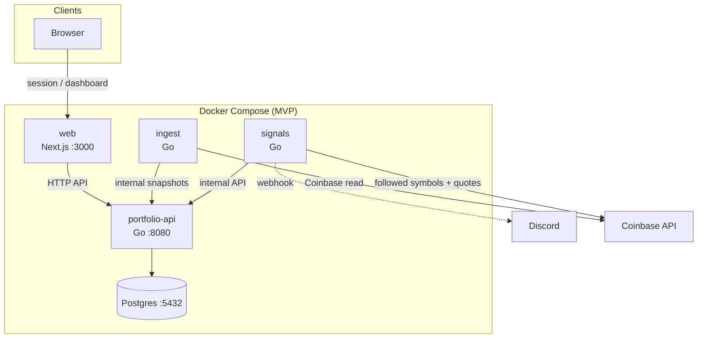

# morgans-d-stonks

Local homelab **crypto portfolio and watchlist** dashboard with deterministic **Coinbase** price-move alerts. Alerts post to **Discord** as a short summary plus fenced **`crypto_signal_v1`** JSON for **OpenClaw** (and similar agents); order execution and IBKR are **backlog**, not the default path.

## Stack

- **Backend**: Go in `backend/` — `portfolio-api`, `ingest`, `signals`
- **Frontend**: Next.js + Tailwind + shadcn/ui in `frontend/`
- **Market data**: Coinbase read API (balances + spot prices for snapshots and signal quotes)
- **DB**: Postgres 16
- **Infra**: Docker Compose

## Architecture

Services share `portfolio-net`. The dashboard talks to `portfolio-api`. `ingest` writes snapshots via the internal API. `signals` reads followed symbols and settings, evaluates price moves, persists recent alerts, and optionally posts to Discord.


```mermaid
flowchart TB
  subgraph Clients
    B[Browser]
  end

  subgraph Compose["Docker Compose (MVP)"]
    W[web<br/>Next.js :3000]
    API[portfolio-api<br/>Go :8080]
    DB[(Postgres :5432)]
    ING[ingest<br/>Go]
    SIG[signals<br/>Go]
  end

  DC[Discord]

  B -->|session / dashboard| W
  W -->|HTTP API| API
  API --> DB
  ING -->|Coinbase read| CB[Coinbase API]
  ING -->|internal snapshots| API
  SIG -->|followed symbols + quotes| CB
  SIG -->|internal API| API
  SIG -.->|webhook| DC
```

## Local development

1. `cp .env.example .env` and set **`DATABASE_URL`**, **`INTERNAL_API_KEY`**, **`COINBASE_READ_API_KEY`**, **`COINBASE_READ_API_SECRET`**, and optional **`DISCORD_WEBHOOK_URL`**.
2. `docker compose up --build` — starts **web**, **portfolio-api**, **ingest**, **signals**, and **Postgres** (no `ib-gateway` or `trading-worker` in the default stack).
3. Open http://localhost:3000 — sign in with **`AUTH_USERNAME`** / **`AUTH_PASSWORD`** from `.env`.
4. API health: http://localhost:8080/api/health

Use Node **22.22.0** for local frontend work (see `frontend/.nvmrc`).

### Crypto alerts and OpenClaw

- The **signals** service uses persisted **alert settings** (threshold %, cooldown) and the **watchlist**.
- When Discord is configured, each firing posts a **one-line summary** and a fenced **`json`** block containing **`crypto_signal_v1`**. OpenClaw can consume that message in Discord.
- **Recent alerts** are stored in Postgres (including the exact JSON payload in **`payload_json`**).

### Backlog (not default)

- **IBKR** and **`ib-gateway`** are not part of the MVP compose story.
- **Order execution** (`/internal/orders`, `/mcp/v1/trades`, `trading-worker`) is implemented in-repo but **disabled** unless **`TRADING_ENABLED=true`**. To experiment, merge the optional override:

  `docker compose -f docker-compose.yml -f docker-compose.coinbase.yml up -d --build`

  See [docs/runbooks/coinbase-trading.md](docs/runbooks/coinbase-trading.md) and [docs/mcp-crypto-execution-spec.md](docs/mcp-crypto-execution-spec.md).

### Stylekit (dashboard)

The UI uses **Tailwind** and **shadcn/ui**. To add primitives:

```bash
cd frontend
npx shadcn@latest add dialog
```

## Project structure

```
backend/         Go backend module
frontend/        Next.js dashboard
.agent/epics/    Historical agent/epic notes (not the live MVP spec)
docs/            Runbooks and MVP verification notes
```

See [AGENTS.md](AGENTS.md) for contributor workflow. **Post-deploy verification** and payload notes: [docs/crypto-mvp-refactor.md](docs/crypto-mvp-refactor.md).

## Linear

[Portfolio platform project](https://linear.app/schtvr/project/portfolio-platform-1e44112535d4) — team `SCH`.
