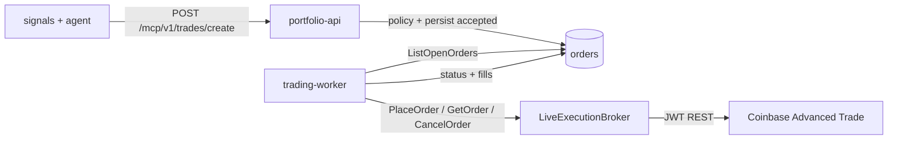

# Live Coinbase Execution Broker — Implementation Plan

> **Status:** Implemented (2026-06). See `backend/internal/broker/coinbase/live.go`.  
> **Owner:** broker / trading-worker  
> **Depends on:** CB-06–CB-15 (persistence, policy, worker, paper adapter, rollout controls)

## Goal

Replace the paper-only execution path with a **Coinbase Advanced Trade live broker** so `trading-worker` can submit real market orders when `BROKER_ENV=live`, while preserving the existing policy envelope, order lifecycle, and reconciliation tables.

## Non-goals (v1)

- Limit / stop / bracket orders (market-only stays)
- Short selling
- WebSocket fill streaming (poll-based reconciliation is enough for v1)
- Sandbox / Coinbase “demo” environment (use `paper` mode + `NewPaperExecution` for simulation)
- Changing MCP or agent decision schema

## Current state

| Component | Behavior |
|-----------|----------|
| `brokerwire.NewExecution` | Returns `NewPaperExecution()` when `Environment=paper`; errors on `live` |
| `config.Broker.ToLegacyBrokerConfig` | Passes **read** keys only — trade keys never reach execution broker |
| `trading.Worker` | Calls `PlaceOrder` once per accepted order; maps status synchronously; no `GetOrder` poll loop |
| `broker.OrderIntent` | `Symbol`, `Side`, `Quantity` only — no quote-size or client order id |
| `docker-compose.coinbase.yml` | Enables trading stack; `BROKER_ENV` driven by `TRADING_BROKER_ENV` |

## Target architecture



### New package surface

Add `backend/internal/broker/coinbase/live.go`:

```go
type LiveBroker struct {
    client *Client // trade-scoped Client using COINBASE_TRADE_* credentials
}

func NewLiveExecution(tradeKey, tradeSecret string) (broker.ExecutionBroker, error)
func (b *LiveBroker) PlaceOrder(ctx context.Context, intent broker.OrderIntent) (*broker.Order, error)
func (b *LiveBroker) CancelOrder(ctx context.Context, orderID string) error
func (b *LiveBroker) GetOrder(ctx context.Context, orderID string) (*broker.Order, error) // optional on interface extension
```

Wire in `brokerwire/wire.go`:

```go
case "coinbase":
    if cfg.Environment == "paper" || cfg.Environment == "" {
        return coinbase.NewPaperExecution(), nil
    }
    if cfg.Environment == "live" {
        return coinbase.NewLiveExecution(cfg.CoinbaseTradeAPIKey, cfg.CoinbaseTradeAPISecret)
    }
```

## Phase 1 — Config and credential split

**Files:** `internal/broker/config.go`, `internal/config/broker.go`, `internal/brokerwire/wire.go`

1. Extend `broker.Config` with `CoinbaseTradeAPIKey` / `CoinbaseTradeAPISecret`.
2. Update `ToLegacyBrokerConfig()` to map `COINBASE_TRADE_*` when `Env=live`.
3. Extend `Broker.Validate()`:
   - `live` + `TRADING_ENABLED` → require trade keys
   - `live` without trade keys → fatal at worker startup
4. Extend `Trading.Validate()`:
   - When `BROKER_ENV=live`: require `TRADING_MAX_NOTIONAL <= hard cap` (e.g. env `TRADING_LIVE_MAX_NOTIONAL_CAP`, default 500)
   - Refuse startup if `TRADING_KILL_SWITCH=true` and `live` (already blocked when both enabled)
5. Add startup log line: `"execution_mode": "live"` with **no secret values**.

**Acceptance:** `trading-worker` with `BROKER_ENV=live` and missing trade keys exits non-zero with clear error.

## Phase 2 — Coinbase order API client

**Files:** `internal/broker/coinbase/live.go`, `live_test.go`, reuse `jwt_rest.go` + `Client.doJSON`

Coinbase Advanced Trade (App API) endpoints (JWT auth, same as read client):

| Operation | Method | Path |
|-----------|--------|------|
| Create market order | `POST` | `/api/v3/brokerage/orders` |
| Get order | `GET` | `/api/v3/brokerage/orders/historical/{order_id}` or batch status |
| Cancel | `POST` | `/api/v3/brokerage/orders/batch_cancel` |

### Request mapping (`OrderIntent` → Coinbase)

MVP supports **market** orders only. Internal `Order` rows store `Quantity` (base) and `Notional` (USD).

| Internal | Coinbase field |
|----------|----------------|
| `Side=buy`, `Quantity>0` | `order_configuration.market_market_ioc.base_size` |
| `Side=buy`, quote-only path | `quote_size` (derive from `Notional` when `Quantity==0`) |
| `Side=sell` | `base_size` from `Quantity` |
| `Symbol=BTC-USD` | `product_id` |

Generate a **client order id** (UUID) per placement; persist as `provider_order_id` immediately on success.

### Response mapping (Coinbase → `broker.Order`)

Map Coinbase `status` strings to internal statuses used by `mapExecutionStatus`:

| Coinbase | Internal |
|----------|----------|
| `OPEN`, `PENDING` | `accepted` |
| `FILLED` | `filled` |
| `CANCELLED` | `canceled` |
| `EXPIRED`, `FAILED` | `rejected` |
| partial fill states | `partially_filled` |

Return `broker.Order{ID: coinbaseOrderID, Symbol, Status, CreatedAt}`.

### Error handling

- 4xx on create → return error; worker records `place_error` reconciliation (existing path).
- Insufficient funds / invalid product → surface Coinbase message in reconciliation `Details`.
- Rate limits → retry with backoff (mirror `doJSON` 429 handling).

**Tests:** HTTP test server with canned JSON; table-driven status mapping; JWT path construction (reuse existing jwt tests).

## Phase 3 — Worker reconciliation for async fills

**Files:** `internal/trading/worker.go`, optional `Executor` interface extension

Paper broker fills synchronously; live orders may stay `OPEN` briefly.

Extend worker `reconcileOrder` branch when `ProviderOrderID != ""`:

1. Call `Executor.GetOrder(ctx, providerOrderID)` (add to interface or type-assert `StatusPoller`).
2. Map observed status; `UpdateOrderStatus` + `AppendOrderEvent` on transitions.
3. On `filled` / `partially_filled`, call `RecordFill` with **actual** fill price/qty from Coinbase fill payload (not synthetic `Notional/Quantity` guess).

Add metric: `trading_live_reconciliation_errors_total`.

**Acceptance:** Integration test with fake executor that transitions `accepted → filled` on second tick.

## Phase 4 — Policy hardening for live

**Files:** `internal/config/trading.go`, `internal/trading/policy.go`, runbook

1. **Double gate for live:** require both `TRADING_ENABLED=true` and explicit `TRADING_LIVE_ACK=true` (break-glass env) before `portfolio-api` registers MCP create routes in live mode — prevents accidental `.env` copy.
2. Log every allowed live order at `Info` with symbol, side, notional, idempotency key (no keys/secrets).
3. Discord webhook on live fill/reject (reuse existing portfolio-api path).
4. Document rollback in `docs/runbooks/coinbase-trading.md`: kill switch → cancel open Coinbase orders via worker/API.

## Phase 5 — Compose and quickstart alignment

**Files:** `docker-compose.coinbase.yml`, `scripts/quickstart.sh`, `.env.example`

- `TRADING_BROKER_ENV=paper|live` passed to `trading-worker` and `portfolio-api`.
- Live mode in quickstart requires trade keys + typed confirmation (`LIVE`).
- README links to this plan.

## Phase 6 — Verification

| Check | Command / criterion |
|-------|---------------------|
| Unit tests | `cd backend && go test ./internal/broker/coinbase/... ./internal/brokerwire/... ./internal/trading/...` |
| Paper regression | Existing paper E2E unchanged |
| Live smoke (manual) | `TRADING_MAX_NOTIONAL=10`, single symbol, kill switch off, verify order in Coinbase UI |
| Policy rejects | Kill switch, symbol deny, max notional — all still 201 + `decision.allowed=false` |
| Rollback | `TRADING_KILL_SWITCH=true` blocks new creates; worker cancel path tested |

## Implementation order (estimated)

| Step | Effort | Deliverable |
|------|--------|-------------|
| 1. Config + wire trade keys | S | Worker starts with live config validation |
| 2. `LiveBroker.PlaceOrder` | M | Single market buy/sell against sandbox or micro-notional |
| 3. `LiveBroker.GetOrder` + worker poll | M | Async fill reconciliation |
| 4. `LiveBroker.CancelOrder` | S | Cancel path for rollback runbook |
| 5. Live rollout gates + docs | S | `TRADING_LIVE_ACK`, runbook update |
| 6. Manual soak + metrics | S | 24h paper then micro live |

## Risks

| Risk | Mitigation |
|------|------------|
| Real money loss on bug | Ship behind `TRADING_LIVE_ACK`; default quickstart stays dry/paper; low `TRADING_MAX_NOTIONAL` |
| Key confusion (read vs trade) | Separate env vars; validate at startup; quickstart prompts label clearly |
| Partial fills / stuck OPEN | Worker poll loop + reconciliation drift metrics + alert rules |
| Coinbase API changes | Pin to documented v3 brokerage paths; integration tests with recorded fixtures |

## Open questions

1. **Single trade key vs read key:** Keep separate `COINBASE_TRADE_*` (recommended) or allow one key with both permissions for homelab?
2. **Minimum live notional:** Enforce Coinbase product min increments via existing `ProductMetadata` cache before submit?
3. **Post-only / slippage:** Defer to v2; market IOC only for v1.

## References

- [Coinbase Advanced Trade API — Create Order](https://docs.cdp.coinbase.com/advanced-trade/reference/retailbrokerageapi_postorder)
- In-repo: `internal/broker/coinbase/jwt_rest.go`, `internal/broker/coinbase/paper.go`, `internal/trading/worker.go`
- Runbook: [docs/runbooks/coinbase-trading.md](../runbooks/coinbase-trading.md)
- Rollout controls: `.board/milestones/coinbase/cb-13.md`
